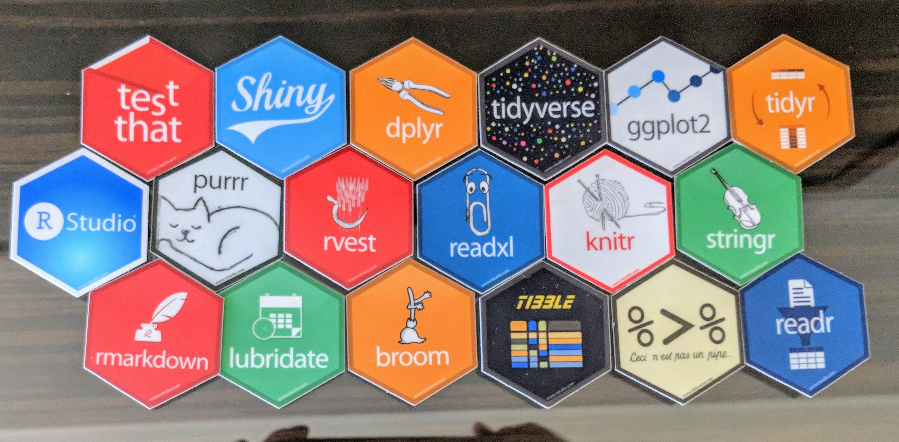

layout: true
background-color: #fafaef
<div class="my-footer"></div>

```{r setup, include=FALSE}
options(htmltools.dir.version = FALSE)
knitr::opts_chunk$set(echo = TRUE)
```

---

## Overall Vibes

--

- fully worth it
--

- good food & well organized
--

- Kraig got to fan out on Hadley
--

- hex stickers!



---

## Asynchronous Operations in Shiny

--

- Joe Cheng, CTO @ rstudio & creator of Shiny
--

- what happens if you run a model in an app, and someone else tries to connect?
--

- new [`promises`](https://github.com/rstudio/promises) package coming
    - another weird pipe: `%...>%`
    - uses `futures` underneath
    - requires support in shiny itself, currently on [`shiny` branch](https://github.com/rstudio/shiny/tree/async)
--
- not specific to shiny

---

## Functional Testing in Shiny

--

- Winston Chang talking about [`shinytest`](https://github.com/rstudio/shinytest)
--

- functional testing using a headless browser
--

- less fragile than `RSelenium`
--

- easy to use: record yourself clicking on stuff
--

- replay from generated code
--

- returns json & jpg
--

- json plays nice with version-control and CI
--

- already has an [rstudio page](https://rstudio.github.io/shinytest/articles/shinytest.html)

---

## Scaling Shiny

--

- Sean Lopp, software dev @ RStudio
--

- demonstrated scaling a shiny app to to 10,001 concurrent users!
--

- built on AWS
    - multiple RStudio Connect servers on EC2
    - ALB Load Balancer
    - Postgres DB's
--
- other tools used
    - Prometheus & Grafana for metrics
    - Fabric (python) for orchestrating the whole thing
--
- new, unreleased `shinyloadtest` tool to fake users
    - should be able to support ~1k on a laptop

---

## Drill-Down Reporting in Shiny

--

- Barbara Borges Ribeiro (`pool`!)
--

- didn't go, but sounded cool
--

- ask Kraig

---

## Modeling in the Tidyverse

--

- Max Kuhn, Applied Predictive Modeling & `caret` package
    - employee of RStudio since last fall
--
- `modelr` is dead!
--

- packages that already exist
    - [`rsample`](https://github.com/topepo/rsample) for setting up bootstrap, CV, etc.
    - [`recipes`]() for preprocessing (scaling, centering, etc.)
    - [`tidyposterior`](https://github.com/topepo/tidyposterior) for post-hoc analysis of model stats
    - [`yardstick`](https://github.com/topepo/yardstick) for computing model metrics
    - [`parsnip`](https://github.com/topepo/parsnip) for unified model interface

---

## Modeling in the Tidyverse

--

- Max is clearly embracing the pipeline concept (smells like `sklearn`)
    - going beyond `recipes`
--
- unified model interface means you specify a _type of model_ and a _compute target_
    - e.g. `random forest` and `Spark`
    - don't worry about `randomForest` vs. `ranger` vs. `sparklyr::ml_random_forest` vs. ...
--
- After he nails down some interface/syntax stuff, everything else will come quickly
--

- Slides available on [Github](https://github.com/topepo/rstudio-conf) ([rawgit](https://cdn.rawgit.com/topepo/rstudio-conf/a6d9176bdc62f38c7d6773a8bcc2e6f1d4399536/2018/Modeling_in_the_Tidyverse--Max_Kuhn/Modeling_in_the_Tidyverse.html#1))

---

## Zeallot

--

- Nathan Teetor talking about his [`zeallot`](https://github.com/nteetor/zeallot) package
--

- offers python-like value unpacking on LHS of assignment
```{r, eval=FALSE}
library(zeallot)

c(a, b) %<-% c(1, 2)
c(a, b) %<-% list(1, "foo")
c(a, c(b, c)) %<-% list(1, list("foo", "bar"))
c(res, err) %<-% purrr::safely(log)("whoo")
c(mpg, ...) %<-% mtcars
c(., ., disp, ...) %<-% mtcars
c(mpg, ...rest) %<-% mtcars
```
--

- easy to implement your own "destructor" for custom objects (demonstrated with `quosures`)
--

- slides available via [Google Docs](https://docs.google.com/presentation/d/1MISSEW5-JIulvjsmGETsdLWrgXoncFhb2i2E65KXwi0/edit?usp=sharing)

---
class: center, middle

# Fin!
